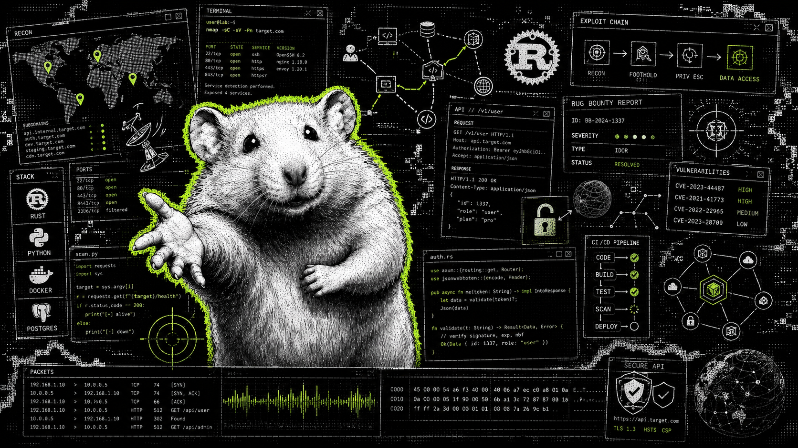

  <strong>Backend / AppSec developer / Offensive security engineer</strong> 
  Rust low-level development, Python services, secure APIs, automation, and practical security tooling.

  
  
  
  

  
  
  
  
  
  
  
  
  
  

  
  
  
  
  

---

### TLDR

- Backend APIs, async workers, databases, CI/CD, and deployment automation.
- Practical AppSec: secure code review, web/API security, OWASP Top 10, vulnerability validation.
- Successful Bug Bounty and VPD cases: confirmed vulnerabilities, clear reproduction steps, and actionable reports.
- Successful OSINT cases, GEOINT work, geolocation analysis, and structured investigation reports.
- Small tools and PoCs that make testing reproducible.

### Stack

`Rust` `Python` `Django/DRF` `FastAPI` `SQLAlchemy` `PostgreSQL` `Redis` `Celery` `Pytest` `Docker` `GitHub Actions` `GitLab CI/CD` `Bash` `JavaScript` `Linux`
